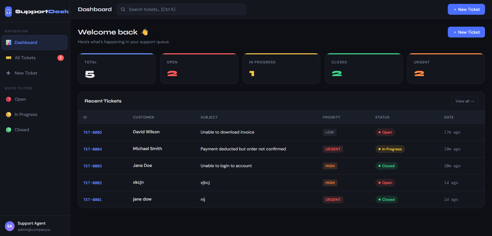
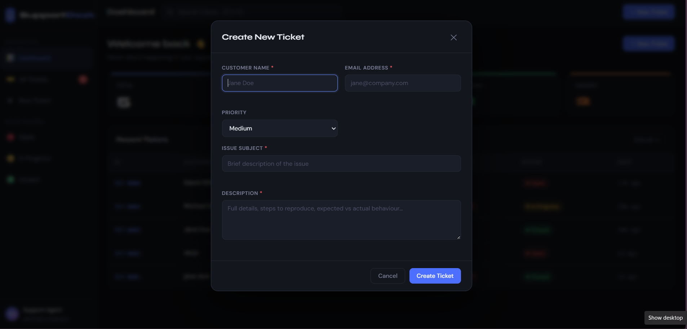

# 🎧 SupportDesk CRM

A full-stack Customer Support Ticketing CRM built using **Python, Flask, SQLite, HTML, CSS, and JavaScript**.

## 📌 Overview

SupportDesk CRM is a web-based application that helps manage customer support tickets efficiently. It allows support teams to create, track, search, filter, and update tickets through a clean and responsive interface.

---

## ✨ Features

* Create support tickets
* Auto-generated Ticket IDs
* Search tickets by customer name, email, ID, and description
* Filter tickets by status
* Sort tickets by priority and date
* View ticket details
* Update ticket status (Open, In Progress, Closed)
* Add notes and comments
* Persistent SQLite database storage
* Responsive dashboard interface

---

## 🛠 Tech Stack

### Backend

* Python
* Flask
* SQLite

### Frontend

* HTML
* CSS
* JavaScript

### Deployment

* Render

---

## 📂 Project Structure

```text
support-crm
│
├── static
├── templates
├── screenshots
├── app.py
├── seed.py
├── support_crm.db
├── requirements.txt
├── README.md
├── Procfile
└── .gitignore
```

---

## 🤖 AI-Assisted Development

AI tools such as ChatGPT and Claude were used during development to accelerate learning, generate initial code ideas, and troubleshoot issues.

The project was not used as a direct copy-paste solution. I modified, structured, debugged, and customized the generated code by:

* Improving the UI and dashboard layout
* Adding search and filtering functionality
* Implementing status updates and ticket management
* Organizing the project structure
* Debugging backend and database issues
* Adding sample data and improving usability

This approach helped me understand the full-stack development workflow while building a working application from scratch.

---

## 🚀 Future Improvements

* Dashboard analytics charts
* CSV export functionality
* Email notifications
* User authentication
* Role-based access

---
## 📸 Screenshots

### Dashboard


### All Tickets


### Create Ticket Modal



---

## 👩‍💻 Author

Built by **Arpita** as part of the Datastraw Technologies Internship Assessment.
